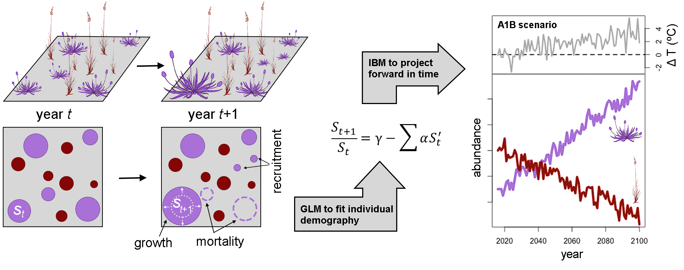

Many of the most dramatic biological impacts of climate change are mediated by species interactions. Still, we largely ignore how climate change influences the way species interact, and how this affects community dynamics. Due to their steep climatic and ecologic gradients, mountains are excellent systems to study how species interactions will influence community dynamics in future climates. 

For the main component of my doctoral research, in collaboration with [Loic Pellisier](http://www.landecology.ethz.ch/the-group/people/loic-pellissier.html), and [Jake Alexander](https://alexanderecology.weebly.com/), we transplanted alpine communities to lower elevations in the Swiss Alps to investigate how species interactions depend on temperature and how novel competitors from lower elevations will impact alpine vegetation. 

By **combining the field experiment with mathematical models** of metacommunity dynamics, I will investigate the timescales of the arrival and impact of low elevation species relative to the changes driven by changing interactions among alpine species. 

## Field experiment

We moved alpine turfs downslope along an elevational gradient in the eastern Swiss Alps to impose increasing degrees of climate warming, similar to what these plant communities will experience in the following 100 years of climate change.

Below you can watch a Swiss News report about the experiment. 

<!-- blank line -->

<figure class="video_container">
  <iframe src="https://www.youtube.com/embed/-aKZhiICIRY" frameborder="0" allowfullscreen="true" width="720" height="405"> </iframe>
</figure>
<!-- blank line -->  

## Data collection and modelling approach

Every year we map the position and cover of all plants in the turfs. By comparing maps from one year to the next, we will estimate key demographic rates for each species as a function of climate and the competitive neighbourhood. With these estimated parameters we can build a model to project community dynamics over the next century under different climate change scenarios.

